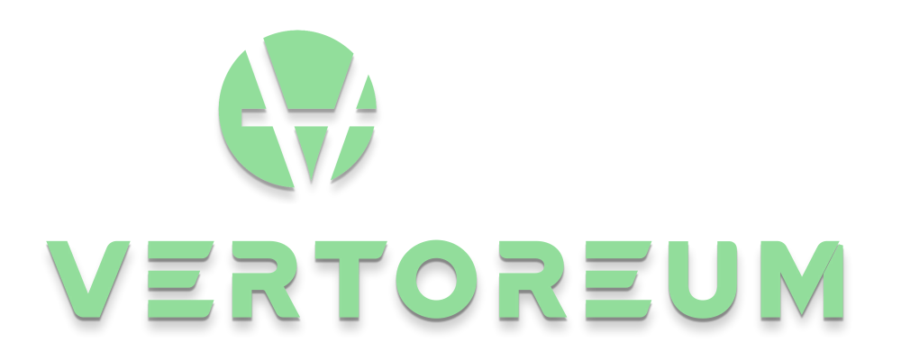

VERTOREUM 
========

Download wallets:
----------

- Wallets available for download : https://github.com/Vertoreum/Vertoreum/releases/latest

Specifications:
----------------------

• Name:                 Vertoreum

• Ticker:               VTRM

• ASICS resistant

• Protected against double spend and 51% attacks

• Adopts Segwit transactions

---

• Algorithm:          YescryptR16

• Block Time:         5 minutes

• Block Reward:       50 VTRM

• Difficulty:         Every block with VertoreumDifficulty calculation

• Halving:            105,000 blocks (1 year)

• P2P Port:           16178

• RPC Port:           16179

• Max supply:         10,500,000 VTRM

• POW Confirmations:  3,360,000 blocks - 32 years

• Premined:           None

• Chain type:         POW

---

Links
----------------

• Website: 

• Explorer: 

• Mining Pool: 

• Discord: 

• Telegram: 

• Twitter: 

• Reddit: 

• Instagram: 

• Forum: 

License
-------

Vertoreum is released under the terms of the MIT license. See [COPYING](COPYING) for more
information or see http://opensource.org/licenses/MIT.

